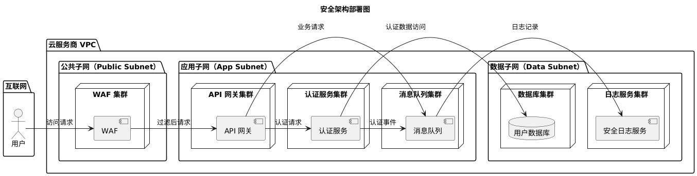

# 以NFR场景为主，通过DFX方法解决现代化产品质量问题

## 1. 摘要

在现代软件开发中，功能性需求（系统做什么）往往得到充分关注，但决定系统成败的非功能性需求（NFRs）——即系统“如何”运行——却常常被忽视或以模糊、难以衡量的方式提出。诸如“系统要快”、“必须稳定”这类期望，因缺乏具体的可度量性，导致架构设计缺乏明确目标，最终引发用户体验差、安全漏洞和性能瓶颈等严重问题。

本文旨在提出一个系统性的解决方案，该方案将 **质量场景（Quality Scenarios）** 的精确描述能力与 **卓越设计（Design for Excellence, DFX）** 的前瞻性方法论有机融合。主张，通过将模糊的质量期望转化为由六个关键元素（激励源、激励、制品、环境、响应、响应度量）构成的具体、可测量的 NFR 场景，为架构设计提供清晰的验收标准。随后，将这些场景作为特定 DFX（如：为性能而设计、为安全而设计）流程的输入，指导架构师做出精准的技术选型和设计决策，从而将质量内建于系统设计的每一个环节。

最终目标是构建一个从需求识别到设计验证的闭环框架，使团队能够系统性地应对复杂的质量挑战，确保最终交付的软件产品不仅功能完备，更在性能、可靠性、安全性及可维护性等方面达到卓越标准。

## 2. 非功能性需求（NFR）的挑战与演进

### 2.1. 传统NFR的困境

软件项目的利益相关者（Stakeholders）通常对系统质量有着朴素而直接的期望。这些期望往往表现为一系列模糊的形容词：

* “我希望系统响应**快**。”
* “系统必须是**可扩展**的。” 
* “我们要提供**良好的用户体验**。”
* “代码要**易于维护**。”

当软件架构师试图将这些期望整理成需求列表时，可能会得到一张包含数十个“质量特性”（如可伸缩、可靠、安全、可用、可维护等）的清单。然而，这样的清单在实践中几乎是无用的，原因在于：

1.  **缺乏可衡量性**：团队无法就“快”或“稳定”的具体含义达成共识，更无法验证目标是否达成。
2.  **缺乏上下文**：脱离具体业务场景谈论质量是没有意义的。“快”在用户登录场景和报表生成场景下的定义截然不同。
3.  **优先级冲突**：不同的利益相关者对质量的关注点不同，导致在性能、安全和可用性之间难以取舍。

### 2.2. 从模糊到具体：质量场景的引入

要解决上述困境，核心在于将模糊的质量期望转化为具体、可量化且可验证的 **质量场景（Quality Scenarios）**。一个完整的质量场景由六个核心元素构成，它清晰地描述了在特定条件下系统应如何表现。

| 场景元素 | 描述 | 示例：前端快速加载 |
| :--- | :--- | :--- |
| **激励源（Stimulus Source）** | 发出激励的主体，可以是人、系统或其他行动者。  | Web 应用用户 |
| **激励（Stimulus）** | 到达系统的事件，如用户操作、攻击或请求。  | 通过 `https://my-app.app` 加载 Web 应用 |
| **制品（Artifact）** | 激励所作用的系统或其部分。  | Web 前端（Web Frontend） |
| **环境（Environment）** | 场景发生时系统所处的条件。  | 目标浏览器（例如，基于 Chromium 的浏览器） |
| **响应（Response）** | 系统为应对激励而执行的活动。 | 浏览器加载并渲染 Web 前端 |
| **响应度量（Response Measure）** | 对响应结果的可量化评估，用于测试和验证。  | 视口内的主要内容在 **2.5 秒** 内加载完成（可通过LCP度量）  |

通过这种结构化的方式，最初“让前端快一点”的模糊要求，就转变成了“**Web 应用用户在 Chromium 浏览器中加载应用时，其 LCP 指标必须在 2.5 秒以内**”这样一个清晰、可执行的架构驱动力。

下图展示了从模糊期望到具体质量场景的转化过程。


这个过程不仅为设计提供了明确的目标，也为后续的自动化测试和持续集成奠定了基础。

## 3. DFX（Design for Excellence）：将质量融入设计的核心方法论

### 3.1. DFX 核心理念

**卓越设计（DFX）** 是一种前瞻性的工程方法论，其核心思想是在设计阶段就为产品达成某种特定的卓越品质（即“X”）而进行系统性规划和决策。在软件工程领域，“X”直接对应着各种关键的非功能性需求。

常见的软件 DFX 包括：
* **DFP (Design for Performance)**：为性能而设计
* **DFS (Design for Security)**：为安全而设计
* **DFR (Design for Reliability)**：为可靠性而设计
* **DFM (Design for Maintainability)**：为可维护性而设计
* **DFT (Design for Testability)**：为可测试性而设计
* **DFSca (Design for Scalability)**：为可伸缩性而设计
* **DFU (Design for Usability)**：为可用性而设计

DFX 强调质量是**设计**出来的，而不是**测试**出来的。它要求团队在架构设计之初就主动考虑并解决潜在的质量问题。

### 3.2. NFR与DFX的结合

NFR 质量场景与 DFX 方法论构成了一个完美的闭环。
* **NFR 质量场景定义了“什么”（What）**：它以精确、可量化的方式定义了需要达成的质量目标。
* **DFX 方法论提供了“如何”（How）**：它为实现该目标提供了一套系统性的架构原则、设计模式和实践指南。

当一个具体的 NFR 场景被确定后，它就成为了相应 DFX 流程的直接输入，从而启动一个目标明确的设计过程。

下图描绘了 NFR 场景驱动 DFX 的核心工作流。


该流程确保了每一项架构决策都服务于一个明确的、可验证的质量目标，从而避免了过度设计或设计不足。

## 4. 实践框架：以NFR场景驱动的DFX设计流程

### 4.1. 框架概述

将整个实践框架分为三个核心阶段：质量需求识别与场景化、DFX 策略制定与架构设计、验证与持续集成。这一框架旨在将抽象的质量需求系统性地转化为具体的、经过验证的架构实现。

### 4.2. 第一阶段：质量需求识别与场景化

此阶段的目标是从众多利益相关者的期望中，识别出对系统成功至关重要的顶级质量目标，并将其场景化。

1.  **利益相关者访谈**：通过访谈识别不同角色的期望，例如用户关心易用性和性能，而运维人员更关心稳定性和可维护性。
2.  **使用 `Architecture Inception Canvas`**：该工具可以帮助团队在项目初期快速捕获最重要的质量目标，并将其记录在“质量目标（Quality Goals）”区域。
3.  **构建质量场景**：针对捕获的每个高质量目标，使用六元素法构建具体的质量场景，确保其可衡量性。

### 4.3. 第二阶段：DFX 策略制定与架构设计

此阶段是框架的核心，将具体的质量场景转化为架构设计方案。将以两个典型场景为例进行说明。

#### **示例 1：为安全而设计（DFS - Design for Security）**

* **NFR 场景**：外部渗透测试人员（激励源）在模拟生产环境（环境）下，对用户认证接口（制品）进行 SQL 注入攻击（激励）。系统必须能在 1 秒内（响应度量）阻止该攻击并记录详细的安全日志（响应）。
* **DFX 策略与设计**：
    * **架构设计**：采用纵深防御策略。引入 Web 应用防火墙（WAF）作为第一道防线，过滤恶意请求。在 API 网关层面进行请求校验和速率限制。在认证服务中，使用参数化查询或 ORM 框架从根本上杜绝 SQL 注入。所有安全事件都通过异步消息队列推送到一个独立的安全日志分析系统。

    下面的架构图展示了该安全设计的层次关系。
    ```mermaid
    graph TD
        %% 定义样式
        classDef default fill:#fff,stroke:#333,stroke-width:2px;
        classDef sec fill:#ffe6e6,stroke:#c00,stroke-width:2px;
        classDef component fill:#e6f3ff,stroke:#2596be,stroke-width:2px;

        %% 元素定义
        User[外部用户<br/>（渗透测试人员）]
        
        subgraph DMZ [网络隔离区（DMZ）]
            WAF[Web 应用防火墙<br/>（WAF）]:::sec
        end

        subgraph PrivateSubnet [私有子网]
            Gateway[API 网关]:::component
            AuthSvc[认证服务]:::component
            Logger[安全日志服务]:::component
            DB[用户数据库]:::component
            MQ[消息队列]:::component
        end

        %% 流程连接
        User --> WAF;
        WAF -->|"过滤后请求"| Gateway;
        Gateway -->|"认证请求"| AuthSvc;
        Gateway -->|"非法请求日志"| MQ;
        AuthSvc -->|"参数化查询"| DB;
        AuthSvc -->|"认证失败日志"| MQ;
        MQ --> Logger;

        class WAF,AuthSvc,Logger sec;
        class Gateway,DB,MQ component;
    ```
    该架构通过多层防御和职责分离，确保了即使某一层被绕过，后续层次依然能提供保护，从而有效应对 SQL 注入等攻击。

    * **部署策略**：为了实现安全隔离，各组件应部署在不同的网络环境中。

    以下部署图展示了组件的物理或虚拟节点分布。
    
    
    
    此部署方案将直接暴露于公网的 WAF 与核心业务服务和数据存储进行了网络隔离，进一步增强了系统的安全性。

#### **示例 2：为性能而设计（DFP - Design for Performance）**

* **NFR 场景**：Web 应用用户（激励源）在移动 3G 网络（环境）下，通过浏览器加载应用首页（激励）。页面最大内容绘制（LCP）（响应度量）必须在 2.5 秒内完成（响应）。
* **DFX 策略与设计**：
    * **架构决策**：为达成此目标，需采取综合优化策略，包括：
        1.  **减少网络延迟**：使用内容分发网络（CDN）缓存静态资源。
        2.  **优化渲染路径**：采用服务端渲染（SSR）或静态站点生成（SSG）以加速首次内容呈现。
        3.  **减少载荷体积**：实施代码分割（Code Splitting），按需加载 JavaScript；使用 WebP 等现代格式压缩图片。

    下面的组件时序图展示了经过性能优化的页面加载流程。
    ```mermaid
    sequenceDiagram
        participant B as 浏览器
        participant C as CDN
        participant LB as 负载均衡器
        participant WEB as Web 服务器<br/>（SSR）
        participant API as API 网关
        
        B->>+C: 1. 请求静态资源<br/>（HTML, CSS, JS）
        C-->>-B: 2. 命中缓存，快速返回
        
        B->>+LB: 3. 请求页面数据
        LB->>+WEB: 4. 转发请求
        WEB->>+API: 5. 并行请求核心数据
        API-->>-WEB: 6. 返回数据
        WEB-->>-LB: 7. 服务端渲染页面后返回
        LB-->>-B: 8. 返回 HTML
        
        B->>API: 9. 异步请求非核心数据
    ```
    该时序图清晰地展示了如何通过 CDN 缓存和 SSR 机制，最大化地减少了关键渲染路径（Critical Rendering Path）上的阻塞和等待时间。

### 4.4. 第三阶段：验证与持续集成

此阶段的目标是确保架构设计在实现后能够持续满足既定的质量场景。

1.  **自动化验证**：将质量场景的“响应度量”作为自动化测试的断言。
    * 对于性能场景，可使用 Lighthouse、WebPageTest 等工具集成到 CI/CD 流水线中，每次构建都检查 LCP、FCP 等核心指标。
    * 对于安全场景，可集成 SAST（静态应用安全测试）和 DAST（动态应用安全测试）工具，自动扫描代码和运行中的应用。
2.  **持续反馈**：当自动化测试失败时，CI/CD 流水线应立即中止并向开发团队报警，形成快速反馈循环，确保质量问题在进入生产环境前被发现和修复。

## 5. 结论

将软件质量从模糊的期望转变为具体的工程目标，是现代软件架构设计的核心挑战。本文提出的框架，通过有机融合 **NFR 质量场景** 的精确描述能力和 **DFX** 的系统性设计方法，为此挑战提供了行之有效的解决方案。

该框架的核心优势在于：
* **明确性**：将抽象的质量要求转化为具体、可衡量的场景，为设计和测试提供了清晰的标靶。
* **前瞻性**：通过 DFX 方法论，将质量考量前置到设计阶段，实现了从“被动测试”到“主动设计”的转变。
* **系统性**：提供了一个从需求识别、架构设计到持续验证的端到端闭环流程，确保质量目标在整个软件生命周期中得到贯彻和保持。

通过采纳这一以 NFR 场景为驱动、以 DFX 为核心的实践框架，软件架构师和开发团队能够更有信心地构建出不仅功能强大，而且高效、可靠、安全和易于维护的高质量现代化软件系统。

## 6. 参考资料

- [1] Keployio. (2024, October 9). Non-Functional Requirements in Software Development: A Complete Guide. Freedium.
- [2] Roos, P. (2024, March 10). Ultimate Guide to Quality Requirements for Software Architects: Meeting Stakeholder Expectations. workingsoftware.dev.