# NFR-DFX-Quality-Toolkit

[](https://opensource.org/licenses/Apache-2.0)
[](https://github.com/turtacn/NFR-DFX-Quality-Toolkit/actions)

[English](README.md) | [中文](README-zh.md)  | [Concept](Concept.md)


## Overview

NFR-DFX-Quality-Toolkit is a comprehensive open-source project that systematically integrates Non-Functional Requirements (NFR) with Design for Excellence (DFX) methodologies. It provides a complete toolkit for software architects and engineering teams to design, implement, and validate quality-driven software systems.

## Core Pain Points & Value Proposition

### Key Pain Points Addressed
- **Fragmented Quality Practices**: Lack of unified approach to integrate NFR and DFX in software development
- **Implementation Gap**: Missing practical tools and frameworks to translate quality requirements into actionable code
- **Inconsistent Standards**: Absence of standardized metrics and validation methods for quality attributes
- **Limited Reusability**: Lack of reusable components and templates for quality-focused architecture

### Core Value Delivered
- **Systematic Integration**: Seamlessly combines NFR classification with DFX methodology
- **Practical Implementation**: Provides ready-to-use SDKs, frameworks, and tools
- **Measurable Quality**: Establishes quantifiable metrics for 10+ quality attributes
- **Community-Driven**: Fosters collaborative development and best practice sharing

## Key Features

### 📚 Comprehensive Documentation
- **NFR Classification & Metrics**: Detailed coverage of 10+ non-functional requirements
- **DFX Mapping Guidelines**: Complete mapping from DFX categories to software quality attributes
- **Case Studies**: Real-world examples including e-commerce, financial core systems, and IoT platforms
- **Quality Assessment Methods**: QAW and ATAM methodologies with practical templates

### 🛠️ Production-Ready SDK
```go
// Example: Circuit Breaker with Monitoring
import (
    "github.com/turtacn/NFR-DFX-Quality-Toolkit/sdk/resilience"
    "github.com/turtacn/NFR-DFX-Quality-Toolkit/sdk/monitoring"
)

func main() {
    // Initialize circuit breaker with DFR (Design for Reliability) principles
    cb := resilience.NewCircuitBreaker(&resilience.Config{
        Threshold:    10,
        Timeout:      time.Second * 30,
        MaxRequests:  5,
    })
    
    // Integrated monitoring for DFI (Design for Instrumentation)
    monitor := monitoring.NewPrometheusMonitor()
    
    result, err := cb.Execute(func() (interface{}, error) {
        return externalServiceCall()
    })
    
    monitor.RecordLatency("service_call", time.Since(start))
}
````

### 🏗️ Multi-Language Framework Templates

* **Java Microservices**: Spring Boot + Spring Cloud + Kubernetes
* **Go Microservices**: Gin + Helm Charts + GitOps
* **Node.js/TypeScript**: NestJS + Docker Compose + GitHub Actions

### 🔧 DevOps Toolkit

```bash
# Generate project scaffold with DFX principles
./toolkit/cli/dfx-scaffold generate \
  --template=microservice \
  --language=go \
  --dfx-focus=reliability,performance,security

# Run comprehensive quality validation
./toolkit/ci-cd/quality-gate.sh \
  --performance-test \
  --security-scan \
  --chaos-engineering
```

### 📊 Quality Metrics Dashboard

* **Performance**: P50 ≤ 100ms, P95 ≤ 200ms, P99 ≤ 500ms
* **Availability**: 99.95% uptime with RTO ≤ 3min
* **Reliability**: 90% degraded functionality under single component failure
* **Security**: OAuth2 authentication ≤ 50ms, TLS 1.3 encryption

## Architecture Overview

The toolkit follows a layered architecture designed for modularity and extensibility:

```mermaid
graph TD
    subgraph UI[用户界面层（User Interface）]
        CLI[命令行工具（CLI Tools）]
        DOC[文档系统（Documentation）]
    end
    
    subgraph APP[应用服务层（Application Layer）]
        SDK[软件开发包（SDK）]
        FWK[框架模板（Framework Templates）]
        TLK[工具包（Toolkit）]
    end
    
    subgraph CORE[核心业务层（Core Business）]
        NFR[非功能需求（NFR Engine）]
        DFX[卓越设计（DFX Engine）]
        QM[质量度量（Quality Metrics）]
    end
    
    subgraph INFRA[基础设施层（Infrastructure）]
        MON[监控系统（Monitoring）]
        LOG[日志系统（Logging）]
        SEC[安全组件（Security）]
    end
    
    UI --> APP
    APP --> CORE
    CORE --> INFRA
```



For detailed architecture information, see [Architecture Documentation](docs/architecture.md).

## Quick Start

### Prerequisites

* Go 1.20.2+
* Docker & Docker Compose
* Kubernetes (optional, for examples)

### Installation

```bash
# Clone the repository
git clone https://github.com/turtacn/NFR-DFX-Quality-Toolkit.git
cd NFR-DFX-Quality-Toolkit

# Install dependencies
go mod download

# Build the toolkit
make build

# Run examples
make run-examples
```

### Example Usage

```go
// Initialize quality toolkit
import "github.com/turtacn/NFR-DFX-Quality-Toolkit/pkg/quality"

func main() {
    // Create quality configuration
    config := &quality.Config{
        Performance: &quality.PerformanceConfig{
            TargetLatencyP95: time.Millisecond * 200,
            TargetTPS:        2000,
        },
        Reliability: &quality.ReliabilityConfig{
            TargetAvailability: 0.9995,
            MaxFailureRate:     0.001,
        },
    }
    
    // Initialize quality engine
    engine := quality.NewEngine(config)
    
    // Register quality checks
    engine.RegisterCheck("latency", quality.LatencyCheck)
    engine.RegisterCheck("availability", quality.AvailabilityCheck)
    
    // Start monitoring
    engine.Start()
}
```

## Project Structure

```
NFR-DFX-Quality-Toolkit/
├── docs/                    # Documentation and guides
├── sdk/                     # Core SDK components
├── framework/               # Language-specific templates
├── toolkit/                 # CLI tools and utilities
├── examples/                # Complete example projects
├── dev-repo/               # Community collaboration
├── internal/               # Internal packages
├── pkg/                    # Public packages
├── cmd/                    # Command-line applications
└── configs/                # Configuration files
```

## Contributing

We welcome contributions from the community! Please read our [Contributing Guide](CONTRIBUTING.md) for details on:

* Code of Conduct
* Development Process
* Pull Request Guidelines
* Issue Templates

### Quick Contribution Steps

1. Fork the repository
2. Create a feature branch: `git checkout -b feature/amazing-feature`
3. Commit your changes: `git commit -m 'Add amazing feature'`
4. Push to the branch: `git push origin feature/amazing-feature`
5. Open a Pull Request

## Community & Support

* **Documentation**: [docs.turtacn.com/nfr-dfx-toolkit](https://docs.turtacn.com/nfr-dfx-toolkit)
* **Issues**: [GitHub Issues](https://github.com/turtacn/NFR-DFX-Quality-Toolkit/issues)
* **Discussions**: [GitHub Discussions](https://github.com/turtacn/NFR-DFX-Quality-Toolkit/discussions)
* **Discord**: [Join our community](https://discord.gg/nfr-dfx-toolkit)

## Roadmap

* **v1.0.0**: Core SDK and documentation framework
* **v1.1.0**: Advanced monitoring and observability features
* **v1.2.0**: AI-powered quality recommendation engine
* **v2.0.0**: Multi-cloud deployment automation

## License

This project is licensed under the Apache License 2.0 - see the [LICENSE](LICENSE) file for details.

## Acknowledgments

Special thanks to the open-source community and the following projects that inspire our work:

* Spring Cloud Alibaba
* Istio Service Mesh
* Chaos Mesh
* OpenTelemetry
* Kubernetes Operator Framework